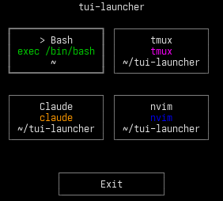
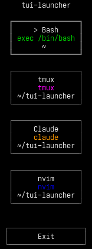
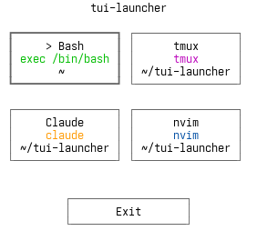
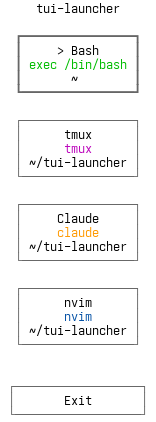

# tui-launcher

Small Brick-based terminal launcher for shell commands. It reads a TOML config,
shows a keyboard-driven tile menu, and replaces itself with the selected
command.

## Screenshots

Both dark and light terminal styles are shown in square and vertical layouts.

### Dark Square



### Dark Vertical



### Light Square



### Light Vertical



## Features

- Arrow keys and `hjkl` move the selection
- `Enter` launches the selected entry
- Mouse click launches an entry and mouse wheel scrolls
- Dedicated `Exit` button at the bottom of the launcher
- Optional per-entry `color` for tile text
- Per-entry `working-dir`, `shell-program`, and `shell-login`
- Auto-created default config at `~/.config/tui-launcher/config.toml`
- Uses your terminal's default colors

## Installation

Download the latest release binary from GitHub Releases and put it on your
`PATH`:

```sh
curl -Lo tui-launcher \
  https://github.com/TharkunAB/tui-launcher/releases/latest/download/tui-launcher-linux-x86_64
chmod +x tui-launcher
install -Dm755 tui-launcher ~/.local/bin/tui-launcher
```

Then run:

```sh
tui-launcher
```

On first launch, `tui-launcher` creates `~/.config/tui-launcher/config.toml` if
it does not already exist.

## Configuration

Use the default config path:

```sh
tui-launcher
```

Or point at an explicit file:

```sh
tui-launcher --config /path/to/config.toml
```

Example config:

```toml
[layout]
tile-width = 20
tile-height = 5
tile-spacing = 1

# [shell]
# program = "/bin/bash"
# login = false

[[entries]]
name = "Shell"
command = "exec \"${SHELL:-/bin/sh}\""
color = "bright-blue"

[[entries]]
name = "nvim"
command = "nvim"
color = "blue"
working-dir = "~/Code"

[[entries]]
name = "Codex"
command = "codex"
color = "bright-magenta"

[[entries]]
name = "Claude"
command = "claude"
color = "orange"

[[entries]]
name = "Tmux"
command = "tmux"
color = "cyan"
working-dir = "~/Code/project"
shell-program = "/bin/zsh"
shell-login = true
```

Layout settings:

- `tile-width`: positive integer, default `20`
- `tile-height`: positive integer, default `5`
- `tile-spacing`: non-negative integer, default `1`

Shell resolution order:

- `entries.shell-program`
- `[shell].program`
- `$SHELL`
- `/bin/sh`

Relative `working-dir` resolution:

- default config: relative to `$HOME`
- `--config /path/to/config.toml`: relative to that config file's directory

Supported entry colors:

- `black`
- `red`
- `orange`
- `green`
- `yellow`
- `blue`
- `magenta`
- `cyan`
- `white`
- `bright-black`
- `bright-red`
- `bright-green`
- `bright-yellow`
- `bright-blue`
- `bright-magenta`
- `bright-cyan`
- `bright-white`

## Development

Use the provided Nix shell for the project toolchain:

```sh
nix-shell
```

Common commands:

```sh
make build
make test
make lint
nix-shell --command "make snapshots"
```
